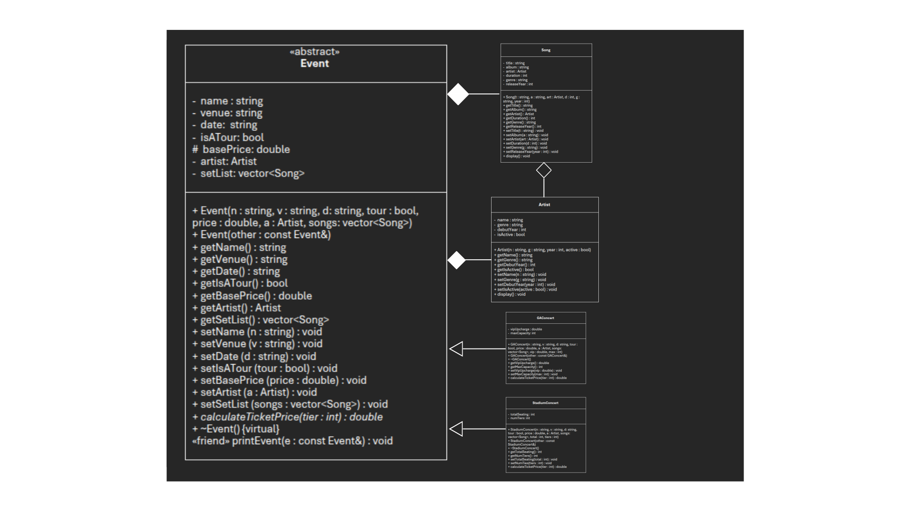

# Music Library
This music library version includes the ability to create/copy events and concerts for artists, as well as caluclate calculate theticker price of your seat using a base ticket price and tier number, representing the "level" of your seat. 

## Additional Classes
- Event
- StadiumConcert
- GAConcert

## Requirements
- Inheritance is shown a "is-a" relationship thorugh the event class, because GAConcert "is-a" Event, and so is StadiumConcert
- I have a constructor for both classes so each object isn't created without missing data. I have a virutal deconstructor for both classes so that the decosntructors for each class cleanup for StadiumConcert or GAConcert, and then event.
- I used a copy constructor in my main to create a copy of stadiumConcert1, and this can be used to help copy over events for both stadium concerts and general admission concerts
- My program uses polymorphishm through calculating ticket price. It does this thorugh a pointer that points to a refernce of stadiumConcert1, which then gets reassigned to a reference of gaConcert1. My code then correctly calculates the ticket price based off of the type of class that is referenced
-All of my private access specificers are the varaibles for each of my classess, and I have one protected access specifier for basePrice, so that my derived classes can use basePrice in them.
- printEvent is a friend function that can use private access specifiers to directly access variables outside that direct class, without the variables needing to have publci access.
- Event is my abstract class becuase caluclateTicketPrice is a pure virtual function. There is no single way to price an "evemt", so it forces every derived way implement pricing.

